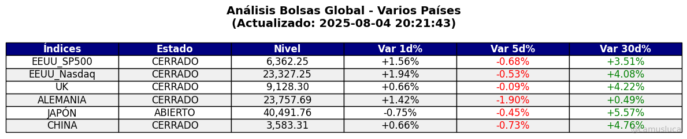
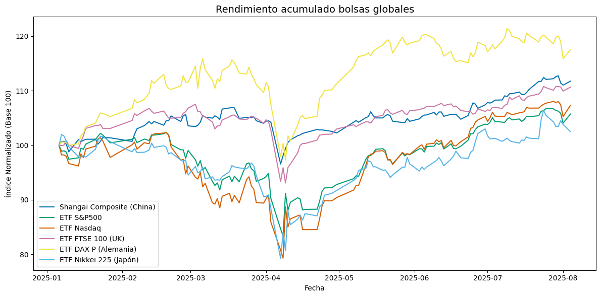
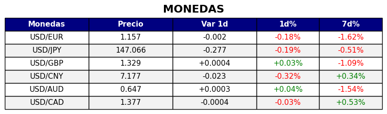
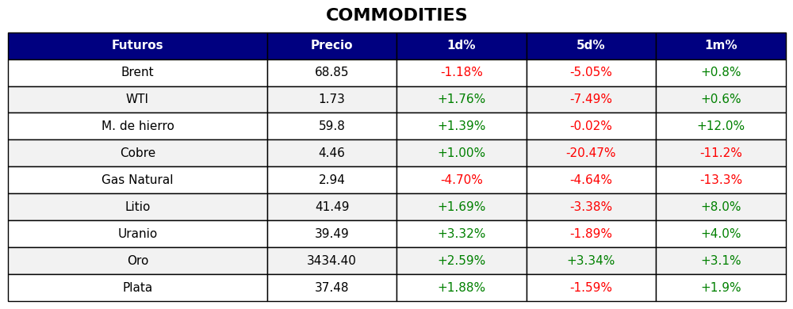
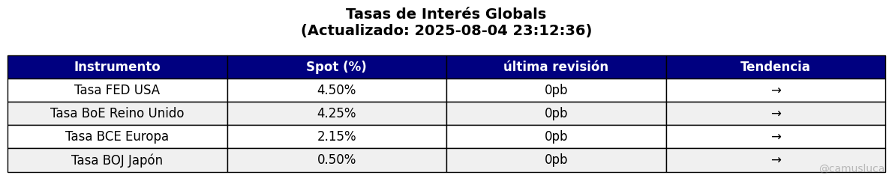

# Update - Global

Este proyecto tiene como objetivo realizar un seguimiento semanal de los principales activos financieros globales. Se presentan visualizaciones simples y actualizadas que permiten monitorear el comportamiento de índices bursátiles, monedas y otros instrumentos clave para el análisis macro-financiero.

## Objetivo

Brindar una herramienta visual y accesible para observar rápidamente:

- El desempeño anual de los principales índices bursátiles globales.
- La evolución de monedas seleccionadas frente al dólar estadounidense.
- Rendimiento de los principales commodities a nivel global.
- Las más recientes decisiones en política monetaria.

## Datos utilizados

Los datos provienen de [Yahoo Finance](https://finance.yahoo.com/) mediante la librería `yfinance`, lo cual permite automatizar la descarga de precios históricos.

### Índices seleccionados

- **Estados Unidos**: S&P 500, Nasdaq.
- **Europa**: FTSE 100, DAX Alemán.
- **Asia**: Nikkei 225, Shanghai Composite.
  
  
  

### Monedas

- Euro (USD/EUR)
- Yen Japonés (USD/JPY)
- Libra Esterlina (USD/GBP)
- Yuan Chino (USD/CNY)
- Dólar Australiano (USD/AUD)
- Dólar Canadiense (USD/CAD)
  
 

### Commodities

- Pretróleo Brent
- Petróleo de Texas
- Mineral de Hierro
- Cobre
- Gas Natural
- Litio
- Uranio
- Oro
- Plata

 

### Decisiones de Política Monetaria

- Federal Reserve (FED)
- Bank of England (BoA)
- Banco Central Europeo (BCE)
- Bank of Japan (BoJ)

## Cómo usar el notebook

1. Cloná o descargá este repositorio.
2. Abrí el archivo `Update_Global.ipynb` en Google Colab o Jupyter Notebook.
3. Ejecutá las celdas para visualizar los datos actualizados automáticamente.

> Requiere conexión a internet para descargar datos desde Yahoo Finance.

## Autor

**Luca Camus**  
Estudiante de Economía | Interesado en Research y Finanzas.  
📧 [lucacamus13@gmail.com](mailto:lucacamus13@gmail.com)  
📎 [LinkedIn](https://www.linkedin.com/in/luca-camus/)

---

